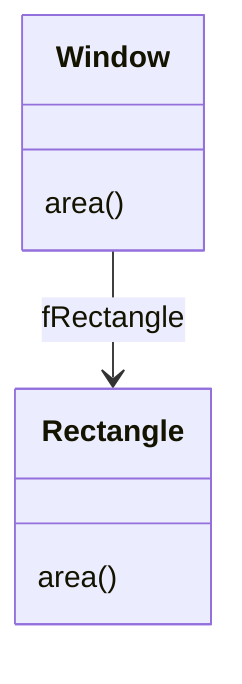

# Frameworks and Design Patterns <!-- omit in toc -->

* [Design pattern](#design-pattern)
  * [What are design patterns](#what-are-design-patterns)
  * [Why do we care](#why-do-we-care)
  * [Where do they come from](#where-do-they-come-from)
* [Creation vs Inheritance](#creation-vs-inheritance)
  * [Delegation](#delegation)
  * [Inheritance Vs Composition](#inheritance-vs-composition)
    * [Inheritance](#inheritance)
    * [Composition](#composition)

## Design pattern

### What are design patterns

Well, there's lots of different definitions.

> A pattern is a named nugget of insight that conveys the essence of a proven solution to a recurring problem within a certain context amidst competing conterns

Here's the key features of the above description:

* **Named nugget** - There's a universally agreed upon name for the pattern.
* **Essence** - Not cut-and-paste.
* **Proven solution** - They've been used again and again and they've been seen to work.
* **Recurring problem** - Through evidence we have seen that this is a problem that occurs again and again and requires a proven solution.
* **Certain Context** - they're not universally applicable.
* **Competing Concerns** - There are trade-offs between aspects of the pattern or the way which we apply them.

### Why do we care

We don't want to be re-inventing the wheel when designing software that has similar requirements.

* Reuse successful design practices
* Improve design communication
  * Vocabulary to talk about software architecture - more than just objects.
  * People talk about architecture in terms of patterns - "We'll use observer here... Or strategy there..."
* Step towards a "Software engineer's handbook"

> I think patterns as a whole caan help people learn OO thinking: how you can leverage polymorphism, design for composition, delecahion, balance responsibilities, and provide pluggable behaviour.
> So patterns are good for learning OO and design in general
> **Erich Gamma**

And just as a side point, learning patterns themselves is a fantastic way of learning about programming in general.

### Where do they come from

Origins come from building architecture. Christopher Alexander described the presence of patterns architecture for houses, buildins and communities. (All levels of abstraction).

This was introduced in software engineering by the Gang of Four, in the book "Design Patterns", which introduces 23 patterns for use within software engineering. It's a very well written textbook, in which the patterns are described using these attributes:

* Patten name and classification.
* Intent - problem addressed.
* Also known as.
* Motivation - example.
* Applicability.
* Structure.
* Participants.
* Collaborations.
* Consequences - trade-offs.
* Implementation.
* Sample Code.
* Known Uses - How this is used in the real world.
* Related Patterns.

There are three categories to these patterns, and we'll be looking at a few from each category.

* Creational
  * Factory method
  * Prototype
* Strutural
  * Adapter
  * Composite
* Behavioural
  * Template Method
  * Observer
  * State
  * Strategy
  * Visitor

These patterns focus on introducing **flexibility** into systems and **accommodating change**.

## Creation vs Inheritance

To fully understand what the difference is here.
We need to understand the concept of **delegation**.

### Delegation

It's delegating responsibility of computation to another object.

* Way of making composition as powerful for reuse as inheritance
* Arrow is an association - a reference to the other class.
* Delegation makes it easy to compose behaviours at runtime
  * In the example below, we could replace Rectangle by Circle ant run-time to create a round window.
* Object often passes itself to it's delegate.

Here, `Window` is **composed** of a `Rectangle` instance. The `area()` method in `Window` **delegates** to the `area()` method in the `Rectangle` object.

### Inheritance Vs Composition

#### Inheritance

Reuse by inheritance is sometimes termed "White-box reuse".

* Internals of parent class may be visible to subclass.

There's an interesting design debate here... does inheritance break encapsulation?

When developing the child class, it's important to understand the parent/ancestor functionality. The changes to parent functionality can affect the chiled in unexpected ways.
Extensive use of inheritance makes OO systems difficult to understand, and it tends to be overused.

#### Composition

An alternative to inheritance is to obtain new functionality by *composing* objects. This is sometimes termed "Black-box" reuse because no internal details are visible.

There are trade-offs to this method as object composition provides run-time flexibility, but the system may possibly be harder to understand.
Hierarchies remain small, but system depends on the interrelationships between larger numbers of objects.

>"Favour object composition over class inheritance"
>**Gang of Four**
