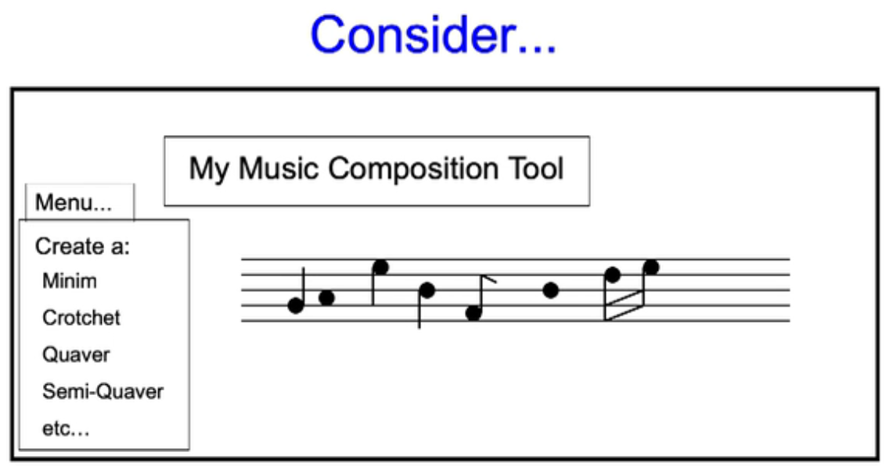

# Prototype Design Pattern 🤖

It's another creational pattern.
Like the factory method, it isolates the client from specific types of objects and supports program to an interface... but!

* Factory method: inheritance
* Prototype: Composition (with some inheritance...)

The key idea here is that new object is created by cloning

* Client is passed a 'prototypical instance' which is a subtype of general interface
* Client clones the instance to create new copies

Used in JHotDraw in `CreationTool` and `ConnectionTool`. These tools create figures and connections.

## Intent

Specify the kinds of objects to create using a prototypical instance, and create new objects by copying this prototype.

## Motivation

Simplify object creation by using existing objects.

## Use when

A system should be independent of how its products are created, composed and represented.
and...
The classes to instantiate are specified at run-time
Class instances differ in only a few combinations of states
    rather than having lots of very similar classes.

## Consider

A music composition tool:

In which we have notes that may be very very similar in nature, but only differ by a small margin, for example the difference between a crotchet and a quaver.

```mermaid
classDiagram
Class Client{
    nice()
}
```

## Implementation Issues

* Implementing the clone operation
  * Deep vs shallow copy
  * Deep copy copies the object and all of it's referenced objects.
    * Is tricky when there are circular references.
  * Shallow copying doesn't copy referenced objects.
* Initialisation
  * Can't pass over the usual construction parameters to clone method. Can use setter mothods immediately after cloning.
* Using a prototype manager
  * When prototypes can be created and destroyed dynamically, keep a registry of available prototypes. The client will store and retrieve them from this registry, for example a computer game with lots of similar characters.

## Consequences

Hides concrete product classes from client

* Let client work with new application-specific, contcrete classes with out modification
* Products can be added ond removed at run-time (benefit compared to the factory method)
* Specify new objects by varying
  * Values
  * Sub-structure - i.e objects within objects, for example sub-circuits in a circuit design editor
* Reduced sub-classing.
