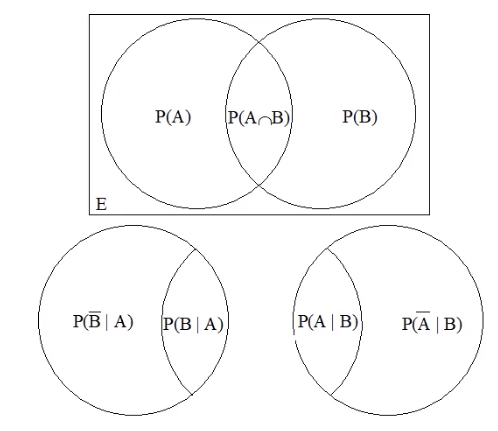
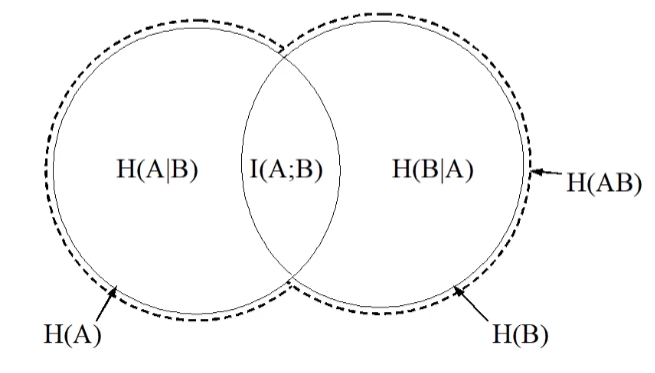

# Table of Contents

1. [What is Information](#i)
   1. [Hartley's Definition](#example2)
   2. [Shannon's Definition](#u)
2. [Probability](#third-example)
3. [Mutual Information](#fourth-examplehttpwwwfourthexamplecom)

# What is information

Well, there are multiple definitions as to what people think information is.
As far as a communication system is concerned, *Information is something that is not already known.*

But that's not good enough, so Hartley proposed a new definition.

## Hartley's Definition

A basic communication system has a **source** and a **destination**.
Hartley's definition of information was:
*"The answer to a question that can assume the two values 'yes' or 'no' (without taking into account the meaning of the question) contains one unit of information."*

* Let a source produce $a$ different symbols $\{S_1,\dots S_a\}$
* Let $l$ such symbols be produced.
* The number of possible combinations of symbols are $a^l$
* The information contained should logically be $l \times$ information in one symbol.
* This should *equal* the information of $a^l$

Let's define a measure of information.

* Let the function $f$ give a measure of information. From before,

$$
l \times f(a) = f(a^l)
$$

What function $f$ satisfies this relationship? The Log function! Therefore, we define information in bits by:
$$
I = \log_2{s}
$$

**If all of our symbols have the same probability of occurring**, then our definition can be rewritten as 

$$
I = -\log_2 P(a)
$$

Where $P(a)$ is the probability of the occurrence of one symbol.

## The Hartley problem

If I have two possible outcomes, and it doesn't matter if they are equally likely outcomes (heads/tails), or completely different (the building is on fire/nothing happening), that's not very intuitive. Hartley's rule still confirms that both situations give the same amount of information:

$$
I(Tossing Coin) = I(Building On Fire)
$$
This is not true in practice, so we need a better definition of information.

## The Horse-Racing problem

The horse-racing problem lets us familiarise ourselves with the shortcomings of Hartley's definition of information.

**We have race number 1:**

* 6 horses are racing
* All horses are *literal duplicates* of each other. They have an equal chance of winning.
This situations says:
$$
I(winner) = log_2(6) = 2.585 \space bits
$$

What about if the problem is slightly different? Let's introduce teams of horses!

**We have race number 2:**

* 6 horses are racing
  * 3 Horses in grey team
  * 3 Horses in black team
* All horses are *literal duplicates* of each other. They have an equal chance of winning.

According to Hartley:
$$
I(winner) = I(winningTeam) + I(winningHorseInTeam)
$$
Basically,

* Is the winner grey or black?
* If the winner is grey, or if the winner is black, what horse on the team was it that won?
Let's put hartley's theory to the test here:
$$
I(winner) = log_22 \space bits
\\+ log_23\space bits
\\ = 1 + 1.585 = 2.585 \space bits
$$

Works out! Neat.

**We have race number 3:**
One of our horses have defected! One grey horse has joined the black team!

* 6 horses are racing
  * 4 Horses in grey team
  * 2 Horses in black team
* All horses are *literal duplicates* of each other. They have an equal chance of winning.

Now, this is where Hartley's definition falls apart.

$$
I(Winner) = \log_22 \space bits \\
+(\log_22 \space bits || \log_24 \space bits)\\
=( 1 + 1 = 2\space bits || 1 + 2 = 3\space bits)
$$

So what is it? 2 bits or 3 bits? Neither is 2.585...?
Well, this is where we can refine things.

## The weighted sum

Let's figure out how we can fix this to accommodate for the defecting horse! We have to break down the information for the winning team, and the winning horse.

**Information about the winning team**
Let find out the information we get about the winning team, now that they're not even. We have to apply the formula to both probabilities:

* The probability of the black team winning with 4 horses : $\frac{2}{3}$
* The probability of the grey team winning with 2 horses: $\frac{1}{3}$

We add both information equations.

$$
I(W_t) = \frac{1}{3}(-\log_2\frac{1}{3}) + \frac{2}{3}(-\log_2\frac{2}{3}) \space bits
\\ = 0.918 \space bits
$$

**Information about the winner from the team**
$$
I(Winner)= (\log_23 - \frac{2}{3})+\frac{5}{3}
\\= \log_23 + 1
\\= 2.585 \space bits
$$

Woohoo! We got the right answer!

## Shannon's Definition

Entropy is a term that Claude Shannon came up with for his new discovery of using expectation to describe information of sources with varying probabilities.

**Why "Entropy"?**

Entropy in the physical world is a concept that's quite similar, but we think it would be better if Shannon called this concept "uncertainty".

**Properties of Entropy**
This new measure - Entropy - is written as H(X).

* Entropy is the uncertainty of an event
* It is a maximum when each possible outcome is equally likely (like tossing a fair coin)
* The ordering of the various outcome probabilities does not matter
* Entropy equals zero only when there is no uncertainty
* Adding an event that will never happen will not affect the entropy.
* Entropy increases with the number of possible outcomes.
* Entropy is a continuous function of it's arguments
* Entropy of two events is equal to the sum of the entropies of the individual events
* We have the "Horse Racing" property too, which allows us to split the entropies into groups.

Remember - there is **no such thing** as an entropy of an outcome, only of an event. If I say it's heads, I'm also saying it's tails.

### Formalising the "Horse Racing" Property

Consider an experiment with $m$ outcomes $a$, and $n$ outcomes $b$. 
*(4 outcomes of black horse winning, and 2 outcomes of grey horse winning...)*

$$H(a_1 \dots a_mb_1\dots b_n)$$

Should equal

$$H(a\space or\space b) + H(a_1 \dots a_m)P(a)+H(b_1\dots b_n)P(b)$$

### What is Entropy, then?

Well, entropy is the "Expected value of information", or the average information given by an event.

$$
H(X) = E(I(X = x_k))\\
= \sum_kp_k * I(X = x_k)\\
= -\sum_kp_k\log_2(p_k)
$$

If all $k$ outcomes have the same probability ($\frac{1}{k}$), then:

$$
= 1 \times \log_2(\frac{1}{k}^{-1}) = log_2k
$$

**KNOW THIS FORMULA**

# Mutual Information

Sometimes a system can let us know about other systems. This is called mutual information. If we observe Y, what does that tell me about X?

To dive into this a little deeper, we have to get into probability theory.

### Probability Review

We need to introduce a new measure: entropy, written as "H".

* If there are more outcomes, then there is a greater H value.
* For two experiments A and B, H(AB) = H(A) + H(B), as long as they're independent.

The probability of event A having outcome $a_k$ is written as $P(A = a_k)$, or $p_k$ for short.
The sum of the probabilities of all possible events is 1.

$$
\sum_kP(A=a_k) = 1
$$
Conditional probabilities are given by
$$
P(A\cap B) = P(A|B)P(B) = P(B|A)P(A)
$$

This can be graphically represented as follows:

### Back to mutual information

Alright, now that we understand how information about X can help us find out information about Y, we can make the following statements:

* Consider two events: X and Y.
* We define the information about X conveyed by Y to be:

$$
I(X;Y) = H(X) - H(X|Y)
$$

**THIS IS A MUST-KNOW FORMULA**

The information about X that's conveyed by Y is equal to the Entropy of X, minus the Entropy of X given Y.

H(X|Y) is a bit un-intuitive.

1. Because it's an entropy, all the possible outcomes must add up to 1.
2. It's the entropy of X given Y. So Y has a particular outcome. So I have to consider all possibilities of X, knowing whatever I know as Y. In other words, It's the uncertainty of X given knowledge of Y.

You can chop and change this about such that:
$$
H(X) - H(X|Y) = H(Y) - H(Y|X)
$$

Graphically, this is very similar to probability.

Here, we can see that the mutual information is H(B) - H(B|A), but also H(A)-H(A|B).

If we have *independent events*, then the entropy of X given Y stays the same. The two systems are completely decoupled - independent.

If we have *dependant events*, then the entropy of X given Y turns out to be 0. If I tell you Y, you would be able to figure out exactly what X is.
