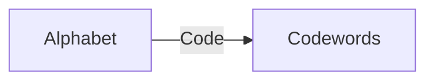
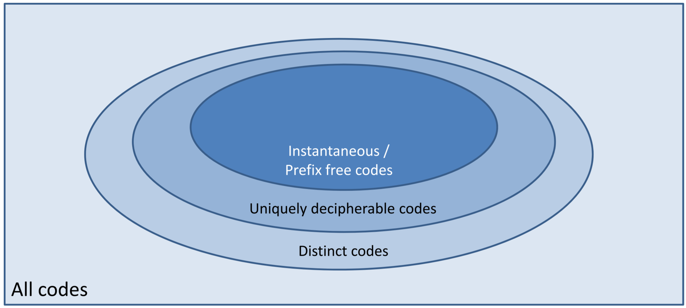
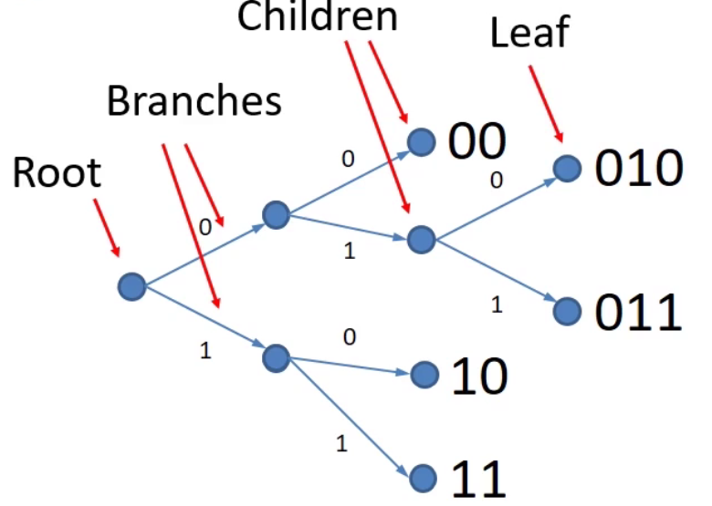
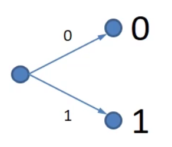
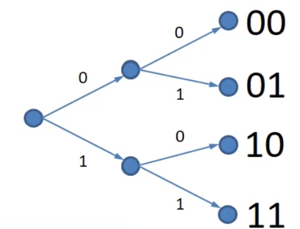
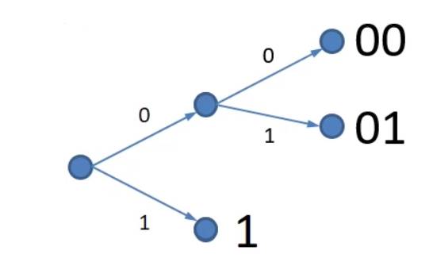
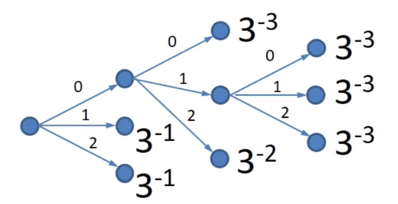
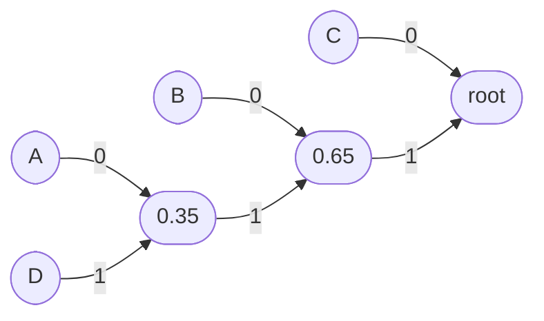
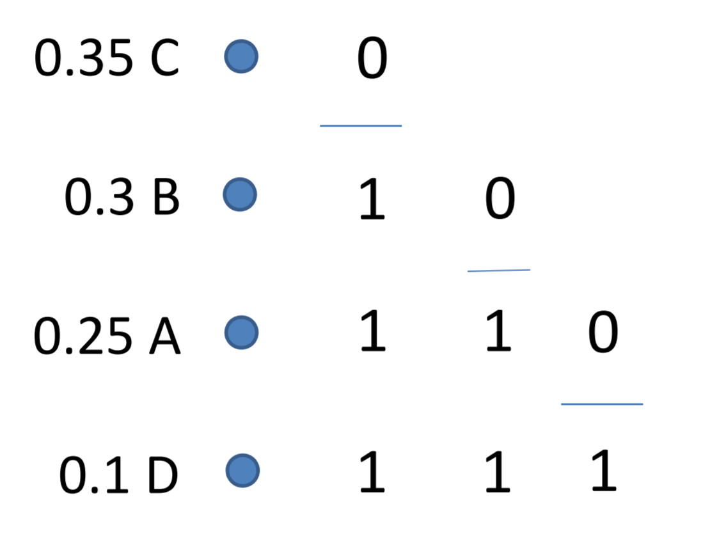

# Coding

* [Coding](#coding)
  * [An Information Source](#an-information-source)
    * [The Coding Process](#the-coding-process)
    * [Types of Coding](#types-of-coding)
    * [Code Properties](#code-properties)
  * [Pulse Code Modulation (PCM)](#pulse-code-modulation-pcm)
    * [Advantages of PCM](#advantages-of-pcm)
    * [Disadvantages of PCM](#disadvantages-of-pcm)
  * [Coding Tree](#coding-tree)
  * [Bounds on codewords](#bounds-on-codewords)
    * [The Kraft Inequality](#the-kraft-inequality)
    * [Kraft McMillan Inequality](#kraft-mcmillan-inequality)
  * [Huffman Coding (Binary)](#huffman-coding-binary)
  * [Fano Coding](#fano-coding)
  * [Minimum Code Lengths](#minimum-code-lengths)
  * [Redundancy in Code](#redundancy-in-code)

## An Information Source

* Consider a source with events producing a string of symbols, $S_i$
* Set of possible symbols is an **alphabet**.
* Strings are $S_1S_2S_3\dots S_n$
* If

$$
P(S_i = a_k) = p_k \forall i
$$

* (The probability of a symbol appearing is the same across all symbols in the alphabet)
* Then the source is **memoryless and stationary**.

### The Coding Process

Coding is a process of mapping source symbols to codewords to make transmission easier.

The code alphabet may be the same or different from the source alphabet. It is often **but not necessarily binary**.

### Types of Coding

We code things for many reasons. Here are the main ones:

* **Source Coding** - To compress our data into as few symbols as possible
* **Cryptographic Coding** - To ensure confidentiality and validity.
* **Channel Coding** - To allow transmission errors to be detected and corrected.
* **Line Coding** - To match the transmission medium characteristics.

### Code Properties

A code usually falls into one or more of these buckets:

* **Distinct** - All of the codewords are different.
* **Uniquely Decipherable** - Any finite string from the encoded string corresponds to at most one message.
* **Instantaneous** - No codeword is a prefix of any other.

It's easier to explain where a code may lie in these categories by using an image:

We can ask a bunch of questions to categorise our code into these categories:

1. Are all codewords different?
   * If not, they're not distinct, and thus not uniquely decipherable and thus not instantaneous
2. Are any codewords a prefix of any other codeword?
   * If not, then it's distinct, uniquely decipherable and instantaneous.
3. Is it uniquely decipherable?
   * List the remainders
      * If any are codewords, then it's **not uniquely decipherable**.
      * If any are prefixes not previously seen, then we add to our remainder list.
      * If all remainders have been previously seen, then it's uniquely decipherable.

| Code | Symbols            | Distinct? | Uniquely Decipherable? | Instantaneous? |
| ---- | ------------------ | :-------: | :--------------------: | :------------: |
| 1    | `A:0, B:1, C:1`    |     ❌     |           ❌            |       ❌        |
| 2    | `A:0, B:1, C:11`   |     ✅     |           ❌            |       ❌        |
| 3    | `A:0, B:10, C:01`  |     ✅     |           ❌            |       ❌        |
| 4    | `A:00, B:10, C:01` |     ✅     |           ✅            |       ✅        |
| 5    | `A:0, B:10,  C:11` |     ✅     |           ✅            |       ✅        |

## Pulse Code Modulation (PCM)

* Codewords are made of all combinations $L$ symbols of cardinality $D$
  * $D_L$ Combinations.
  * Distinct and prefix-free, so uniquely decipherable.
* Often used in combination with quantisation of analogue signals.
* Doubling sampling rate doubles the transmission rate.
* For Binary, doubling sampling rate adds one symbol to each codeword.

Here's an example of a PCM'd signal:

| Amplitude Represented | Code  |
| :-------------------: | :---: |
|           0           |  000  |
|           1           |  001  |
|           2           |  010  |
|           3           |  011  |
|           4           |  100  |
|           5           |  101  |
|           6           |  110  |
|           7           |  111  |

Aww, doesn't that look familiar? 🤭

### Advantages of PCM

It's very simple. 💪

### Disadvantages of PCM

It's not very efficient. 😢

* What happens if our input symbols don't have the same probability?
  * If we're encoding the alphabet, Z would have the same weighting as A although it's much less likely to be sent.
* When the number of input symbols is not a power of the cardinality ofy the code alphabet.

How can we do better? Well, we can introduce the use of **coding trees.**

## Coding Tree

A code tree is a graphical representation of a code.

* The code is uniquely decipherable if each source symbol is represented by a **different** node.
* The code is instantaneous if each source symbol is represented by a **terminating** (leaf) node.

Here's an example of a Binary code with 5 different codewords:

* A root - one single point that all of the other branches flow from
* Branches connect nodes
* Children are all the ends of a branch from a node
* If it's a terminating node, it's called a leaf.

## Bounds on codewords

How many codewords can I actually have? Well, let's consider a couple of examples:

| Length | Code Tree                            |
| :----: | ------------------------------------ |
| **1**  |  |
| **2**  |  |

This means that if I increase the length of the code to $n$, I have $2^n$ codewords.

Each length $n$ codeword can be replaced by 2 codewords of length $n+1$. In the example below, we replace the "0" codeword with a "00" and a "01".

This means that every time I get rid of one of the codewords of length $n$, I replace it with two codewords of length $n+1$. This applies to binary.
If i had a **tertiary** code, I could replace a codeword of length $n$ with **three** codewords of length $n+1$. If we have 4 possible symbols, we can replace it with another 4 codewords and so on...
The first person to notice this was Ralph Kraft in 1949.

### The Kraft Inequality

The Kraft Inequality is a necessary and sufficient condition for an instantaneous (prefix-free) code.
That is that the sum of all codewords, over all possible codeword symbols, $D$ to the power of minus the length of the codeword $-l_i$ must be less than or equal to 1.

$$
\sum^N_{i=1}D^{-l_i} \eqslantless 1
$$

* $D$ is the number of different symbols (the cardinality)
* $l_i$ is the length of the codeword $i$
  
This gives a bound on code length.

Here's an example of how it works:

$3^{-1} +3^{-1} +3^{-2} +3^{-2} +3^{-3} +3^{-3} + 3^{-3} = 1 $
Here, the kraft inequality stands. You can kind of see how it works - every node you replace spawns more nodes with a smaller weighting.

You *cannot* add more than D branches to a leaf node. This would break the inequality.

### Kraft McMillan Inequality

Brockway McMillan (awesome name btw) independently found the same bound for uniquely decipherable codes in 1956 (7 years late...) and here was his expression:

$$
\sum^N_{i=1}D^{-l_i} \eqslantless 1
$$

It's the same damn thing. This is why the bound is now more commonly known as the **Kraft-McMillan Inequality**.
Brockman was a bit of a lucky guy, as traditionally if you re-discover someone else's invention, well, hard luck, they got there first.

## Huffman Coding (Binary)

The Huffman coding algorithm is a way of constructing a coding tree with probabilities of the symbols occurring in mind. Here is the process:

1. Create $r$ leaves corresponding to the $r$ possible symbols and assign their probabilities. Mare these leaves as **active**.
2. (Non-binary only) Pad our leaves with probability 0 leaves such that we have $1+(D-1)i$ leaves for some $i$.
3. Create a node that has the two *least likely* active leaves as children. Activate this node and deactivate the children.
4. If there is one active node left, root it. Otherwise repeat the previous step.

If we're dealing with non-binary data, the node we create should have *D* children, not two.

## Fano Coding

Fano coding is another way of coding data more efficiently than PCM by using code trees. Here is the algorithm:

1. Arrange the symbols in decending order of probability.
2. Divide the list into two parts with as even probability as possible.
3. Assign one part of the list 0, and the other 1 so that codewords in the first list start with 0 and the other start with 1.
4. Repeat 2 and 3 for any parts of the list with more than one member.

If we're dealing with non-binary data, we don't split into *two*, but into however many symbols are in our alphabet, D.

## Minimum Code Lengths

The noiseless coding theorem:

* The minimum length of a code over an alphabet with D symbols is $\frac{H}{\log(D)}$, where $H$ is the entropy.
* Furthermore, a code exists with length $\eqslantless(1+\frac{H}{\log(D)})$
* Therefore, for binary codes, the length must be greater than or equal to the entropy in bits.

## Redundancy in Code

The average length of a code is:

$$
L_{av} = \sum_ip_il_i
$$

The *redundancy* of a code is:

$$
\frac{L_{av}-L_{min}}{L_{av}}
$$

The *efficiency* of a code is:

$$
\frac{L_{min}}{L_{av}}
$$

For the **binary** case, redundancy is:

$$
(\frac{L_{av}-H}{L_{av}})
$$
