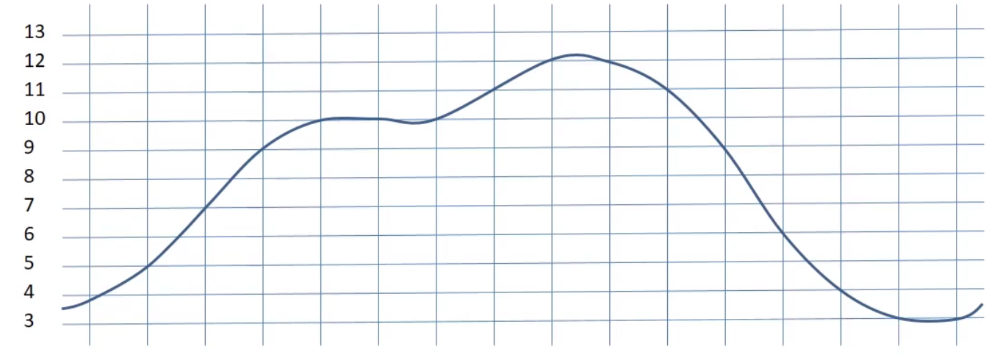
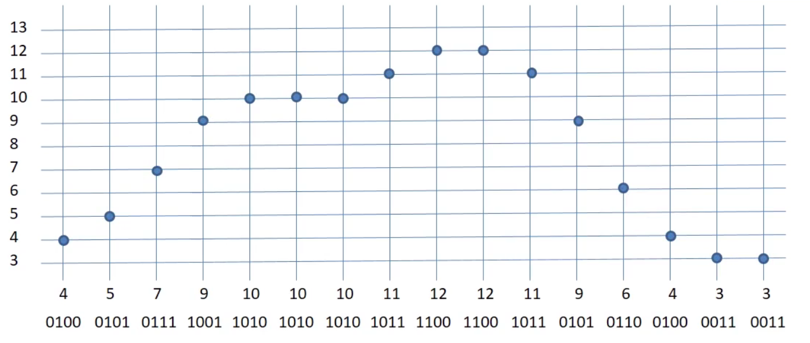
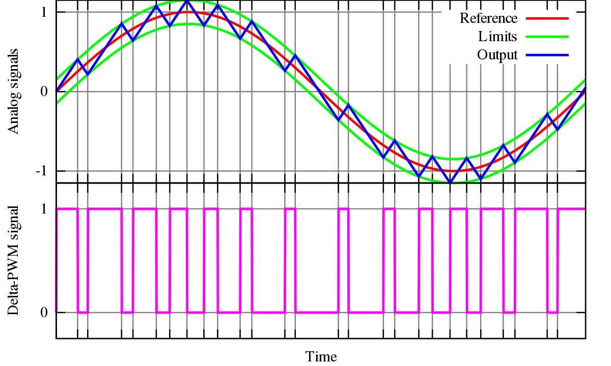
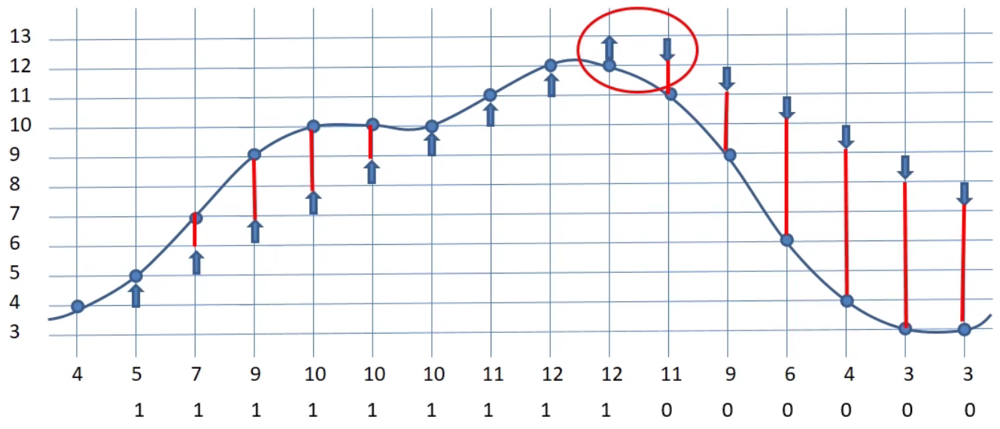
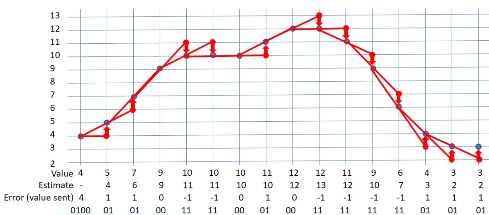
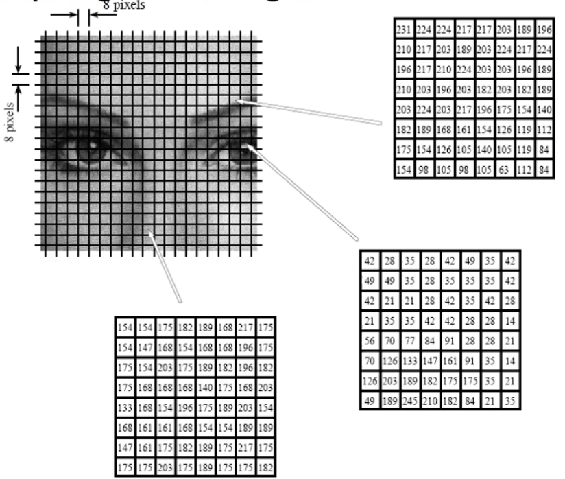
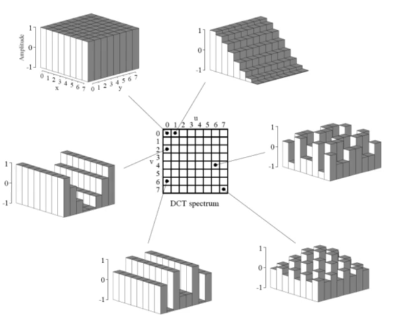
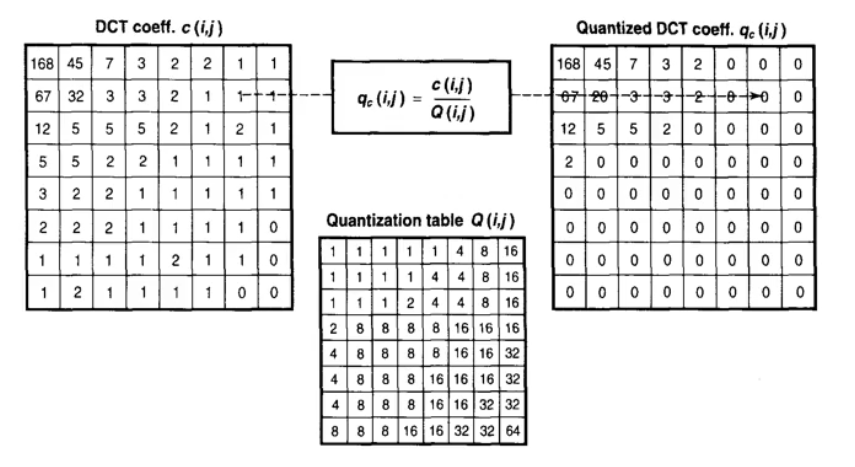
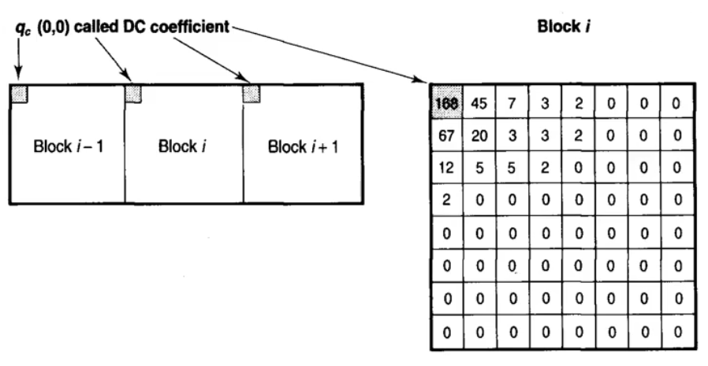
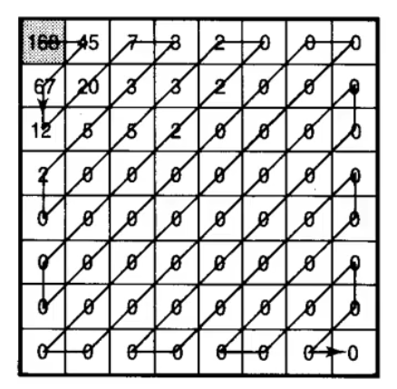

# Coding sources with Memory

## Contents

* [Coding sources with Memory](#coding-sources-with-memory)
  * [Contents](#contents)
  * [Pattern Substitution](#pattern-substitution)
    * [Run-length encoding](#run-length-encoding)
    * [LZ77 Compression](#lz77-compression)
      * [LZ77 Example](#lz77-example)
    * [LZW (Lempel-Ziv-Welsh) Compression](#lzw-lempel-ziv-welsh-compression)
      * [LZW Example](#lzw-example)
      * [LZ Applications](#lz-applications)
  * [Differential Encoding](#differential-encoding)
    * [Delta Modulation](#delta-modulation)
    * [Differential PCM](#differential-pcm)
    * [Adaptive DPCM (ADPCM)](#adaptive-dpcm-adpcm)
  * [Transform Encoding](#transform-encoding)
    * [JPEG Coding](#jpeg-coding)

## Pattern Substitution

If you have a source that contains a memory, then that source will introduce patterns into the sequences that are being sent because of that memory. If we can recognize those patterns, then we can use that to compress the data being sent. This is called **pattern substitution**. Encoding the patterns.

A simplistic approach is just looking for repeating characters, and for a lot of sources, that is the sort of thing that we will see. However, for something like English text, the patterns are a lot more sophisticated, so we need to take a more sophisticated approach.

### Run-length encoding

Run-length encoding is a lossless compression method. The method is done by replacing runs of characters by the character and a count.

There are multiple variants of run-length encoding:

* Zero Suppression - only zeroes are run length encoded:
  * 25000325442300000212252 -> 25**03**3254434**05**212254
* Flagged literals - Allow single characters to be marked as not being encoded (saves inflating diverse sequences)
* Implicit characters (e.g black and whit pixels - always start with white, say, to avoid sending character itself).

Fax transmission is a great example of a complicated application of run-length encoding.

* Excellent example of efficient bet complex compression algorithm
* The challenge is that you have to transmit a detailed image of an A4 page down a POTS line in a matter of seconds.
* An image is 1145 lines with 1728 black or white pixels
* Run-length encoding is used to group the black and white pixels
* Huffman encoding is used on the output.

### LZ77 Compression

LZ77 is a complex pattern substitution method. It looks at what has already been transmitted and tries to match what is going to be transmitted with any previous string that was transmitted up to that point. If a match is found, then a pair consisting of a pointer back to the previous string and the first character that didn't match is sent.

1. Find the longest match in the window
2. Output the pair (P,C), where:
   1. P is a pointer back to the match;
   2. C is the first character that didn't match;
3. Move to the next un-encoded part of the string, and return to 1

If there is no match (like when you start encoding), send (0,0) as a 'special' match to nothing.
LZSS - Includes a bit flag allowing uncoded information to be sent instead of output pairs.

#### LZ77 Example

Try to encode AABCBBABCA.
| Step | Pos | Match | Char | Output  | Encodes  |
| ---- | --- | ----- | ---- | ------- | -------- |
| 1    | 1   | -     | A    | (0,0) A | A        |
| 2    | 2   | A     | B    | (1,1) B | **A**B   |
| 3    | 4   | -     | C    | (0,0) C | C        |
| 4    | 5   | B     | B    | (2,1) B | **B**B   |
| 5    | 7   | ABC   | A    | (5,3) A | **ABC**A |

### LZW (Lempel-Ziv-Welsh) Compression

* Improvement af LZ78, itself an improvement over LZ77
* Uses a dictionary of strings
* At the start, the dictionary contains all possible single characters (roots)

#### LZW Example

1. C:= next character; P:= Prefix (Initially 0)
2. Is the string P+C present in the dictionary?
   1. If yes, P:= P+C (extend P with C)
   2. If no,
      1. Output the code work which denotes P to the codestream;
      2. Add the string P+C to the dictionary
      3. P:= C (P now contains only the character C);
3. Any more characters?
   1. If yes, go back to step 2;
   2. If no, output codeword for P

Encode ABBABABAC

**Dictionary:**
| Position | Value |
| -------- | ----- |
| 1        | A     |
| 2        | B     |
| 3        | C     |
| 4        | AB    |
| 5        | BB    |
| 6        | BA    |
| 7        | ABA   |
| 8        | ABAC  |

**Steps:**
| Step | Pos | Entry     | Output | String |
| ---- | --- | --------- | ------ | ------ |
| 1    | 1   | AB -> 4   | (1)    | A      |
| 2    | 2   | BB -> 5   | (2)    | B      |
| 3    | 3   | BA -> 6   | (2)    | B      |
| 4    | 4   | ABA -> 7  | (4)    | AB     |
| 5    | 6   | ABAC -> 8 | (7)    | ABA    |
| 6    | -   |           | (3)    | C      |

#### LZ Applications

LZ77 + Bit flags of literals (LZSS) + Huffman Encoding used for DEFLATE.

* DEFLATE is the most common zip compression format
* Zip is just an archive format rather than a compression type

LZW is used for UNIX compress and GIF encoding!

## Differential Encoding

Differential encoding is very commonly used when encoding values that come from the real world. The real world doesn't really change very quickly. What that means is that we can use the current value to *predict* the next. Generally speaking, differential encoding schemes are **lossy**, but you can - by allowing for all different change values - make them lossless.

For instance, take a look at this signal:

We can encode all of the individual values of the signal at a given sample rate. Here, we'd end up with 64 bits for all of these 16 values.

### Delta Modulation

An old method, but effective for different types of signal is called delta modulation. It's *really* easy to do. There's a threshold detector that is designed using an Op-amp and a capacitor. What it does is create a bit of a sawtooth wave depending on the threshold. Using this method we can **only go up or down**.

This is a good, cheap, effective way of transmitting signals that are very gradual in nature such that the delta modulator can keep up. This is called **slope overload**. Here's an example of when a modulator can't really keep up.

As you can see, when the signal changes quickly, the delta modulator can only do so much to keep up. A way of helping with the slope overload is by increasing the sample rate of the modulator.

We can improve on the basic concept with a little bit of extra complexity. This is called differential PCM.

### Differential PCM

What we can do is *estimate* what we think the next value is going to be (estimation calculation is pre-arranged with the sender and receiver) and send how the actual signal **differs** from the *expected* value. It's best shown with a table:

| Step | Value | Estimate | Value sent (error) |
| ---- | ----- | -------- | ------------------ |
| 0    | 4     | -        | 4                  |
| 1    | 5     | 4        | 1                  |
| 2    | 7     | 5        | 2                  |
| 3    | 9     | 7        | 2                  |
| 4    | 10    | 9        | 1                  |
| 5    | 10    | 10       | 0                  |
| 6    | 10    | 10       | 0                  |
| 7    | 11    | 10       | 1                  |
| 8    | 12    | 11       | 1                  |

Sending the value would take up 64 bits, whereas sending a differentially encoded PCM signal only takes 49 bits. We're also sending this at no loss of quality.
*But we can do better.*

### Adaptive DPCM (ADPCM)

Here, we are yet again increasing the sophistication in guessing where the signal is going by taking into account the direction of movement of the signal.

* Our first packet we just send the value outright.
* Our second packet we just assume the signal stays constant.
* Our third packet is where things get interesting.
  * We examine the gradient that the first two points made, and extrapolate that to guess the third point.
  * We then send the error in our guess, and update our gradient accordingly so that the fourth packet can be sent.

This, again *halves* our bandwidth. We could get 4 users on a phone-line where you would originally get one!

## Transform Encoding

Patterns and other things in this world are often easier to see in a different domain. For example, the time and space domain can be converted to a frequency domain because, generally, in the real world things don't change that fast so lower frequencies are going to predominate.  If you change into the frequency domain, you can encode those lower frequencies using less data and effect - *compression*.
Another example is audio - a microphone can hear more frequencies than the our ears can, so if we're transmitting for human audio consumption there is no point in transmitting the frequencies that *we can't even hear*.

### JPEG Coding

One more good example is a JPEG. JPEG compression is actually quite complex. Here's a TL;DR:

* Sample the image
* Form 8x8 blocks. For each block:
  * Take Discrete Cosine Transform *(from spacial domain to frequency domain)*
  * "Quantise" - we get rid of the high-frequency components - this is the lossy bit
  * Perform differential encoding on the DC component
  * Use Run-Length encoding
  * Use Huffman or Arithmetic coding on the result.

Let's break these steps down a little.

| Step                          | Description                                                                                                                                                                                                                                                                                      |
| ----------------------------- | ------------------------------------------------------------------------------------------------------------------------------------------------------------------------------------------------------------------------------------------------------------------------------------------------ |
| Sampling the Image            |                                                                                                                                                                                                                                                         |
| Discrete Cosine Transform     |                                                                                                                                                                                                                                                     |
| Quantisation                  |    This is the clever bit. We divide all of our values by what's in the quantisation table. We effectively get rid of the less important frequency components. We can adjust the amount of compression by changing the values in our quantisation table. |
| DC differential encoding      |                                                                                                                                                                                                                                                               |
| Run Length encoding on raster |                                                                                                                                                                                                                                               |
So, basically,

Here we conclude, that when the audience is human, we can get very very high compression.
