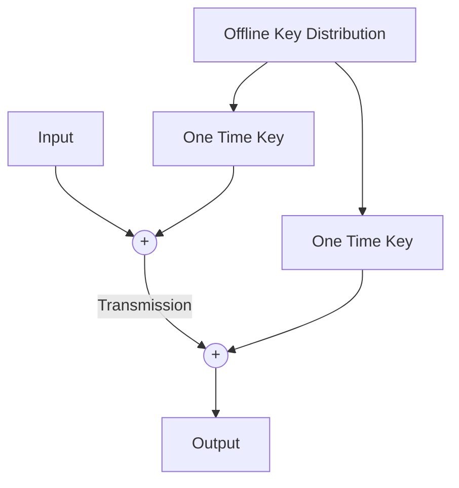

# Cryptography <!-- omit in toc -->

* [Information Theory Viewpoint](#information-theory-viewpoint)
* [Important Definitions](#important-definitions)
* [Perfect Cryptosystem Conditions](#perfect-cryptosystem-conditions)
* [Key Appearance Equivocation](#key-appearance-equivocation)
* [A Perfect Cryptosystem](#a-perfect-cryptosystem)
  * [One Time Encryption](#one-time-encryption)

Information theory gives us an insight into lots of different things, and it gives us an insight into the bounds on cryptography; how big our keys *actually* have to be in order to have perfect cryptosystems. One thing it doesn't do is tell us how to *build* these cryptosystems.

## Information Theory Viewpoint

We can calculate the entropy for the message, key and ciphertext in the usual way;

$$
H(M) = -\sum p(m)\log(pm)
$$

What we're interested in, is

$$
I(M;C)
$$

That is the mutual infermation between the message and the ciphertext. *Just how much* does knowing the ciphertext tell us about the message? In a good system, we don't want that to be very much.

## Important Definitions

In this context - equivocation is the *reduction of uncertainty* ala entropy.

* Message equivocation, H(M|C)
  * The uncertainty remaining about the message given knowledge of the ciphertext.
* Key Equivocation H(K|C)
  * The entropy of the key given knowledge of the ciphertext.
* Key appearance equivocation H(K|(M|C))
  * The uncertainty about the key given knowledge of both the plaintext and ciphertext.

## Perfect Cryptosystem Conditions

To construct a perfect cryptosystem, we want the following:

* We want the message equivocation $H(M|C)$ to be as near as possible to $H(M)$.
  * If $H(M|C)$ = $H(M)$, then that mean that $I(M;C) = 0$, which is a perfect cryptosystem.
  * I.e knowledge of the ciphertext would give no information about the message.
* We want the key equivocation $H(K|C) = H(K)$
  * This gives I(K;C)
  * I.e knowledge of the ciphertext would give no information about the key.
  * This is important due to Kerchoff's assumption - that the encryption algorithm is *known.*

## Key Appearance Equivocation

Let's have a think about this one. Let's take the entropy of everything:

$$H(K,M,C)$$

To do this, we can take the entropy of the message and the ciphertext, and then just add on the entropy of the key.

$$=H(K|(M,C)) + H(M,C)$$

This means that the entropy of the key, message and ciphertext is equal to the entropy of the key, given the message and ciphertext plus the entropy of the message and the ciphertext.
We can also rewrite it as this:

$$=H(M|(K,C)) + H(K,C)$$

We can break this down even further:

$$=H(K|(M,C)) + H(M|C) + H(C)\\
=H(M|(K,C)) + H(K|C) + H(C)$$

These two equations are equal, so we can equate them and we end up with this:

$$H(K|(M,C)) = H(K|C) - H(M|C)$$

The key appearance equivocation is the key equivocation less the message equivocation.

We want this to be high, **but** this implies minimising $H(M|C)$, which is undesirable, therefore there is a trade-off.

## A Perfect Cryptosystem

$$I(M;C) = H(M) - H(M|C)\\
H(K|(M,C)) = H(K|C)-H(M|C) >= 0\\
Therefore H(K|C) >= H(M|C)\\
I(M;C) >= H(M)-H(K|C)$$

If I tell you what the ciphertext is, I *might* give you a clue as to what the key is, but I'll never make you *more* uncertain about what the key is.

$$I(M;C) \geq H(M)- H(K)$$

Where does that get us? Well, I really want - for my perfect cryptosystem - our mutual information between the message and the ciphertext to be zero.

$$I(M;C) = 0$$

This means, our entropy of the key must be greater than or equal to the entropy of our message.

$$H(K) \geq H(W)$$

We can **actually build this cryptosystem!**

### One Time Encryption

We have a key that we only ever use once

The trick here must be random, and at least as long as the message. We've basically moved the information sharing problem into the past, as we have to have the keys distributed between the two parties anyway. This isn't really that good for an information system.
How do we get random generation anyway? Computers can't generate randomness due to their nature. The way we do it is through measuring things in the real world - lava lamps, Cosmic Background Radiation among other things.
We have to be careful, though, as for every paper that shows how we can derive entropy from the real world, there's another paper that will show us how to bias it.
