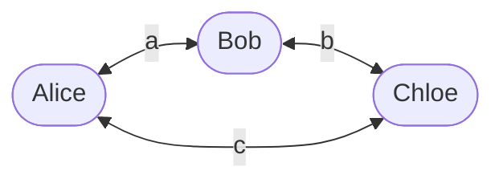

# Different Encryption Protocols

## Hybrid Encryption

* Public key slow, but solves the key distribution problem,
* Symmetric key is fast, but distributing keys is an issue
* Why not have both?
  * Use public key crypto for initial contact
  * Once identity and secure channel is established, you generate a random session key.
  * Continue using the session key

A problem with authentication of parties remains...

### Secure Connection

Here's an example of a secure connection:

1. Connection request is made
2. Here, signed, is my public key and certificate
3. Nice, your certificate is OK, here is a key
4. Communication continues with exchanged key

### Compromised Connection (MITM)

Here's an example of a compromised connection:

1. Connection request is made
2. Here is mi signed public key and certificate (MITM has forged a certificate)
3. Certificate is OK, here is a key
4. Communication continues, but now the MITM has the key to encrypt and decrypt all traffic.

## Digital Signatures

* Bob must be able to hold alice to her word
* The purpose of a digital signature is to 'sign' a message or receipt so that it can be proved that Alice sent it
* This is possible with a private key system if keys are kept by Alice, Bob, and a **registry**.
* Bob accepts messages as signed if he can decrypt the signature with his key
* The central registry can check the signature in a dispute.

## Public Key Digital Signatures

* We can dispense with the trusted registry if we use a public key authentication protocol
* Use mesasge or hash of message as the 'random' cryptogram
* Alice signs using private key, and encrypts everything with Bob's public key for sending
* Bob decrypts the message with his private key, and checks the signature entrypted with Alice's public key equals the message.

### Public Key Signature Problem

* If bob can find another message with the same hash aso the one he signs, he can claim that was the message
* Easuer than just making a change
  * "The birthday attack"
To solve this, we use huge hashes (80+ bits)
Alice makes minor change to message, gets bob to sign.

## Other Protocols

Cryptography also encompasses other protocols, such as oblivious transfer (giving a secret without knowing the recipient or the exact secret passed)

* Electronic voting
* Electronic cash
  * Secure from forgery
  * Universal accreditation
  * Anonymity
* Remote coin toss shows common principles.

### Secure Coin Tosses

Alice and Bob want to flip a coin by telephone. (They have just divorced, live in different cities, want to decide who gets the car.) Bob would not like to tell Alice HEADS and hear Alice (at the other end of the line) say "Here goes... I'm flipping the coin .... You lost!" Manuel Blum, 1981

* Who gets the dog is a better scenario
  * The dog may drool, so Alice might want to fake loosing as well as faking winning!

#### Requirements

Neither party can cheat, therefore if alice tosses and bob calls:

* Bob cannot select his outcome based on Alice’s toss (i.e.he must chose before the toss)
* Alice must be able to hold him to that call after the toss,but must not be able to influence the outcome of the toss based on it so she can’t cheat either.

#### Protocols

Alice picks two primes $p$ and $q$ and send Bob $n=pq$
– Forming roots over this field requires knowledge of p and q, so only
Alice can do it (c.f. RSA)

* Bob chooses a number between 1 and n/2, and squares it. The square has 4 roots
* Alice roots it. She chooses one of the two between 1 and n/2, and sends part of it to Bob
* If it matches, she wins, otherwise Bob wins
* Alice sends Bob p and q so he can calculate the other root and check the procedure

#### Meeting the Requirements

* Alice can’t cheat, because her ‘call’ is a pure 50:50 guess
* Bob can’t cheat, because he doesn’t know the other root, and can’t find it because he doesn’t know p and q

Note Alice only sends the first bit which is different between the two possible roots, so that she doesn’t give away the second root to Bob if he in fact chose the other one. That way, Bob cannot change his mind.

#### Dining Cryptographers’ Problem

A protocol allowing one of three cryptographers to flag
whether they have done something, without reveiling who
they are
• Each person tosses a coin with each of their neighbours
• They states publically the XOR of the coins tosses
• Sum all XORs
• The sender inverts their XOR
• If sum = 0, no-one sent. If sum = 1, someone did

* Alice returns a^c
* Bob returns b^a
* Chloe returns c^b
* Total is a^a^b^b^c^c=2a+2b+2c=0
